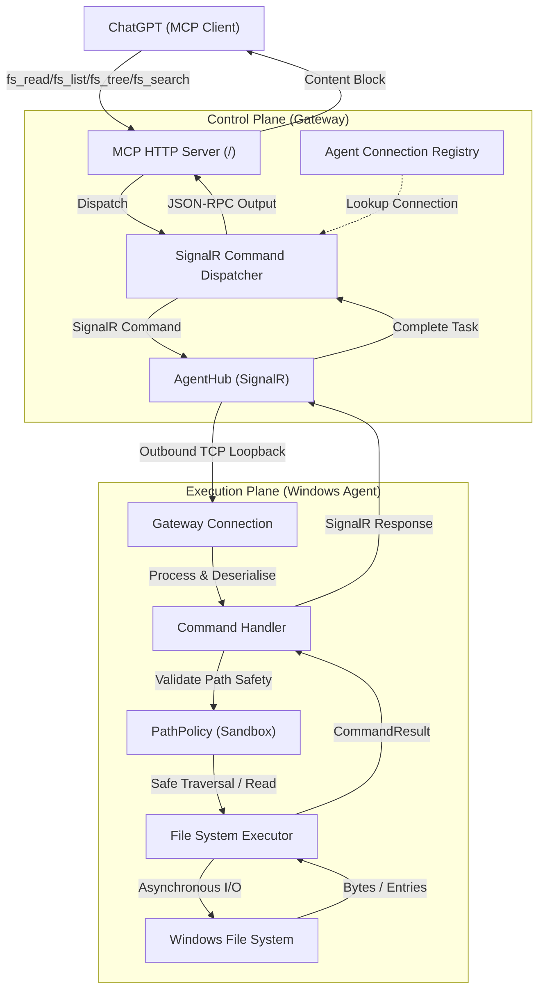

# LocalMcp - Local Windows File System MCP Gateway

LocalMcp is a secure and performant system that exposes the local Windows file system to AI clients (such as ChatGPT) using the Model Context Protocol (MCP). It features a strict separation of concerns between the Control Plane (Gateway) and the Execution Plane (Windows Agent) connected via a real-time SignalR connection.

---

## System Architecture



---

## Exposed MCP Tools

The system implements the following read-only MCP tools:

1. **`fs_tree`**: Returns a bounded directory tree structure for a path inside an allowed root. Used to understand overall project layout.
2. **`fs_list`**: Lists the immediate subdirectories and files of a directory, sorted directory-first and alphabetically.
3. **`fs_search`**: Recursively searches for files matching a query (either by filename or content search) within a directory.
4. **`fs_read`**: Reads the full text content of a single allowed file. Includes file size, encoding (UTF-8 / UTF-8-BOM) detection, and SHA-256 hash.

> [!NOTE]
> All tools return clean, structured JSON errors instead of leaking raw system exceptions to ChatGPT.

---

## Security Sandbox (PathPolicy)

To protect the host machine, the Windows Agent runs all filesystem operations through a strict `PathPolicy` validation loop:

1. **Empty Rejection**: Rejects null, empty, or whitespace paths immediately.
2. **Canonical Normalisation**: Resolves the path to its absolute physical form, resolving relative segments (`.`, `..`).
3. **Link Resolution**: Recursively resolves symbolic links and junctions to check the final destination.
4. **Allowed Root Verification**: Enforces that the resolved path starts with a directory in the configured `AllowedRoots`.
5. **Prefix Collision Prevention**: Prevents prefix matching exploits (e.g. allowed root `F:\Project` vs sibling `F:\ProjectFake\secret.txt`).
6. **Deny List Filtering**: Confirms no directory segment (e.g. `bin`, `obj`, `.git`, `node_modules`) or filename (e.g. `.env`) matches the configured denylists.
7. **Existence Checks**: Verifies files exist (for reads) or directories exist (for listing/tree/search).
8. **Size Validation**: Rejects reading files exceeding `MaxReadBytes` (default 2MB) before buffer allocation.

---

## Configuration

### Windows Agent Configuration
Edit `src/LocalMcp.Agent.Windows/appsettings.json`:

```json
{
  "Agent": {
    "DeviceId": "development-machine",
    "GatewayUrl": "http://localhost:5227"
  },
  "FileAccess": {
    "AllowedRoots": [
      "F:\\All Project"
    ],
    "DeniedSegments": [
      "bin",
      "obj",
      ".git",
      ".ssh",
      ".vs",
      ".idea",
      "AppData",
      "Windows",
      "Program Files",
      "node_modules"
    ],
    "DeniedFileNames": [
      ".env",
      ".env.local",
      "credentials.json"
    ],
    "MaxReadBytes": 2097152
  }
}
```

---

## How to Run

### 1. Run the Gateway
The Gateway hosts the MCP server on port **5227** (mapped at the root `/`).
```powershell
dotnet run --project src/LocalMcp.Gateway
```
* Or use `run-gateway.bat`.

### 2. Run the Agent
The Agent starts a background worker service and connects outbound to the Gateway's Hub.
```powershell
dotnet run --project src/LocalMcp.Agent.Windows
```
* Or use `run-agent.bat`.

---

## Verification & Testing

### Testing with MCP Inspector
The Model Context Protocol Inspector is the official tool to inspect and test MCP servers.

1. Install and start the inspector on a local port:
   ```powershell
   npx -y @modelcontextprotocol/inspector
   ```
2. Open the inspector page in your browser (usually `http://localhost:6274`).
3. Select **Streamable HTTP** as the Transport.
4. Set the URL to:
   ```text
   http://localhost:5227/
   ```
5. Click **Connect**. You will see the list of the four tools: `fs_read`, `fs_list`, `fs_tree`, and `fs_search`.
6. Fill in the arguments (e.g., `deviceId: "development-machine"`, `path: "F:\All Project\_Đang build\AgentBridge"`) and click **Call Tool**.

### Refreshing ChatGPT MCP Host
When you modify or add tool definitions, you must tell ChatGPT to refresh the schemas:
1. In ChatGPT, click your Profile / Customise GPTs or go to the Developer Console where the MCP server is configured.
2. Under the configured MCP Server Host URL (`http://localhost:5227/` or your Cloudflare Tunnel URL), click the **Refresh** or **Re-fetch** button.
3. This forces ChatGPT to fetch `tools/list` again and update its instruction templates.

---

## Important Security Warnings

> [!WARNING]
> **Read-Only Scope Limitation**
> Currently, the system only supports read-only operations (`fs_read`, `fs_list`, `fs_tree`, `fs_search`). Filesystem mutation tools (e.g. write, edit, delete) are **not** implemented in this phase.

> [!CAUTION]
> **Public Tunnel Warning**
> The current development setup allows running a public Cloudflare Quick Tunnel with **no authentication**.
> - This configuration is **development-only**.
> - Write tools **must never** be exposed through a public unauthenticated Gateway.
> - The Gateway checks configuration at startup: in `Development` environment it logs a high-visibility warning; in `Staging` or `Production` environment it will **fail startup** if public exposure is enabled without authentication.

---

## Project Structure

```text
LocalMcp/
├─ LocalMcp.sln                 # .NET Solution File
├─ Directory.Build.props        # TargetFramework (net8.0)
├─ src/
│  ├─ LocalMcp.Gateway/          # Control Plane Web Host
│  │  ├─ Program.cs              # Startup & Public Exposure Guardrail
│  │  ├─ DependencyInjection.cs
│  │  ├─ Hubs/
│  │  │  └─ AgentHub.cs          # SignalR Hub connecting to Agents
│  │  ├─ Mcp/
│  │  │  └─ FileSystemTools.cs   # Exposes MCP tools & routes to dispatcher
│  │  ├─ Security/
│  │  │  └─ SecurityOptions.cs   # Public exposure safety settings
│  │  ├─ Connections/
│  │  │  ├─ IAgentConnectionRegistry.cs
│  │  │  └─ InMemoryAgentConnectionRegistry.cs
│  │  └─ Commands/
│  │     ├─ ICommandDispatcher.cs
│  │     └─ SignalRCommandDispatcher.cs
│  │
│  ├─ LocalMcp.Agent.Windows/    # Execution Plane Worker Service
│  │  ├─ Program.cs
│  │  ├─ DependencyInjection.cs
│  │  ├─ Worker.cs               # Background worker loop
│  │  ├─ Connection/
│  │  │  ├─ AgentOptions.cs
│  │  │  └─ GatewayConnection.cs # Strictly deserialises and routes commands
│  │  ├─ Commands/
│  │  │  └─ CommandHandler.cs    # Dispatcher to executor
│  │  ├─ FileSystem/
│  │  │  ├─ IFileSystemExecutor.cs
│  │  │  └─ FileSystemExecutor.cs # Performs async disk I/O, search, listing
│  │  ├─ Security/
│  │  │  ├─ FileAccessOptions.cs
│  │  │  ├─ IPathPolicy.cs
│  │  │  └─ PathPolicy.cs         # Directory-level sandbox policy
│  │
│  ├─ LocalMcp.Contracts/        # Shared DTOs
│  │  ├─ Commands/
│  │  │  ├─ AgentCommand.cs
│  │  │  ├─ ReadFileCommand.cs
│  │  │  ├─ ListDirectoryCommand.cs
│  │  │  ├─ TreeCommand.cs
│  │  │  └─ SearchFilesCommand.cs
│  │  └─ Results/
│  │     ├─ CommandError.cs
│  │     ├─ CommandResult.cs
│  │     ├─ ReadFileResult.cs
│  │     ├─ ListDirectoryResult.cs
│  │     ├─ TreeResult.cs
│  │     └─ SearchFilesResult.cs
│  │
│  └─ LocalMcp.BuildingBlocks/   # Shared Constants
│     ├─ Errors/
│     │  └─ ErrorCodes.cs        # 16 standard error codes
│     └─ Serialization/
│        └─ JsonOptions.cs
│
└─ tests/
   ├─ LocalMcp.UnitTests/        # Unit tests (Path Policy, Strict Deserialisation, Guardrails)
   ├─ LocalMcp.IntegrationTests/ # End-to-end SignalR integration loop tests
   └─ LocalMcp.ArchitectureTests/ # Circular dependency checker tests
```

---

## Running Tests

Run all test suites with:
```powershell
dotnet test -c Release
```
All automated tests use dynamic, isolated temporary directories and clean up after themselves.
