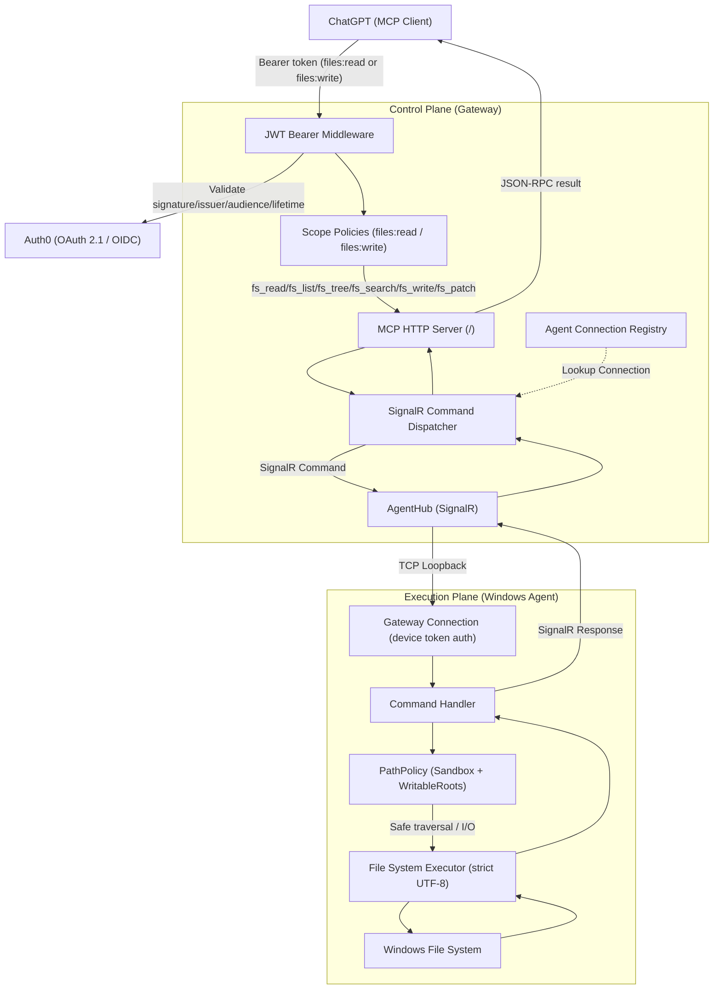

# LocalMcp — Local Windows File System MCP Gateway

LocalMcp is a secure, production-shaped system that exposes the local Windows file system to AI clients (such as ChatGPT) using the Model Context Protocol (MCP). It uses a strict separation between the Control Plane (Gateway) and the Execution Plane (Windows Agent), connected via SignalR.

---

## System Architecture



---

## Exposed MCP Tools

### Read tools — require `files:read` scope

| Tool | Description |
|---|---|
| `fs_tree` | Returns a bounded directory tree. Used by ChatGPT to understand project layout. |
| `fs_list` | Lists immediate children of a directory, sorted directory-first then alphabetically. |
| `fs_search` | Recursively searches for files matching a query (filename or content). |
| `fs_read` | Reads the text of a single file. Returns size, encoding, SHA-256, and content. |

### Write tools — require `files:write` scope

| Tool | Description |
|---|---|
| `fs_write` | Creates or overwrites a single file using optimistic concurrency (SHA-256 ETag). |
| `fs_patch` | Applies a list of exact text substitutions atomically to an existing file. |

> [!IMPORTANT]
> **Write tools are disabled by default.** `WritableRoots` in `appsettings.json` is an empty list. You must explicitly add directories before write tools can succeed.

> [!NOTE]
> All tools return structured JSON errors. Internal paths, stack traces, and `.tmp_` filenames are never leaked to MCP clients.

---

## Security Model

### OAuth 2.1 (Gateway)

All MCP tool calls require a valid Bearer token issued by Auth0.

Token validation enforces:
- **Signature** — RS256 signed by Auth0's JWKS
- **Issuer** — must match `Security:OAuth:Authority`
- **Audience** — must match `Security:OAuth:Audience`
- **Lifetime** — `nbf`/`exp` checked with zero clock skew
- **Scope** — `files:read` for read tools; `files:write` for write tools

The OAuth 2.1 protected-resource metadata is published at:
```
GET /.well-known/oauth-protected-resource
GET /.well-known/oauth-protected-resource/mcp
```

### PathPolicy sandbox (Windows Agent)

Every filesystem operation passes through `PathPolicy` before executing:

1. **Empty rejection** — null/whitespace paths rejected immediately.
2. **Canonical normalisation** — resolves absolute physical path, collapses `..` segments.
3. **Symlink/junction resolution** — recursively resolves links to check the final destination.
4. **AllowedRoots check** — resolved path must be inside a configured allowed root.
5. **Prefix collision prevention** — `F:\Project` does not grant access to `F:\Project-evil\`.
6. **DeniedSegments** — blocks `bin`, `obj`, `.git`, `.ssh`, `AppData`, etc.
7. **DeniedFileNames** — blocks exact names (`.env`, `id_rsa`) and wildcard patterns (`.env.*`).
8. **DeniedWriteFileNames** — additional write-specific name denials (`.gitconfig`, etc.).
9. **DeniedWriteExtensions** — blocks certificate/key file extensions (`.pem`, `.key`, `.pfx`, `.p12`, etc.).
10. **ReadOnly file check** — write operations reject files with the `ReadOnly` attribute.
11. **WritableRoots check** — write operations require the resolved path to be inside a writable root.
12. **Size validation** — reads reject files > `MaxReadBytes` (default 2 MB); writes reject content > `MaxWriteBytes` (default 512 KB).

### Device token (Agent → Gateway SignalR)

The Windows Agent authenticates to the Gateway's AgentHub using a separate device bearer token configured under `AgentSecurity`.

---

## Configuration

### Windows Agent — `src/LocalMcp.Agent.Windows/appsettings.json`

```json
{
  "Agent": {
    "DeviceId": "development-machine",
    "GatewayUrl": "http://localhost:5227"
  },
  "FileAccess": {
    "AllowedRoots": [ "F:\\Your Project Root" ],
    "WritableRoots": [],
    "DeniedSegments": [ "bin", "obj", ".git", ".ssh", "node_modules" ],
    "DeniedFileNames": [ ".env", ".env.*", "id_rsa", "id_ed25519", "credentials.json" ],
    "DeniedWriteFileNames": [ ".env", ".env.*", "id_rsa", "id_ed25519", ".gitconfig" ],
    "DeniedWriteExtensions": [ ".pem", ".key", ".pfx", ".p12", ".cer", ".der" ],
    "MaxReadBytes": 2097152,
    "MaxWriteBytes": 524288
  }
}
```

> [!IMPORTANT]
> To enable `fs_write` and `fs_patch`, add the target directory to `WritableRoots`.
> Start with a dedicated scratch directory (`F:\scratch`) and only expand after testing.

### Gateway — `src/LocalMcp.Gateway/appsettings.json`

```json
{
  "Security": {
    "AuthenticationEnabled": true,
    "PublicExposure": true,
    "PublicBaseUrl": "https://mcp.yourdomain.com",
    "OAuth": {
      "Authority":       "https://your-tenant.auth0.com/",
      "Audience":        "https://mcp.yourdomain.com",
      "RequiredScopes":  [ "files:read" ]
    }
  },
  "AgentSecurity": {
    "AuthenticationEnabled": true,
    "DeviceTokens": [ "your-device-secret-token" ]
  }
}
```

Use `appsettings.Local.json` (git-ignored) for secrets. Never commit tokens to source control.

---

## How to Run

### 1. Start the Gateway

```powershell
dotnet run --project src/LocalMcp.Gateway -c Release
```

Or: `run-gateway.bat`

### 2. Start the Agent

```powershell
dotnet run --project src/LocalMcp.Agent.Windows -c Release
```

Or: `run-agent.bat`

### 3. Verify the connection

The Agent logs `[AgentHub] Connected as <deviceId>` when the SignalR handshake succeeds.

---

## Testing with ChatGPT

### Initial auth flow

1. Open your ChatGPT developer connector or MCP Inspector.
2. Set the MCP URL to `https://mcp.yourdomain.com/`.
3. Click **Connect** — ChatGPT fetches `/.well-known/oauth-protected-resource` and redirects to Auth0.
4. Authenticate with your Auth0 credentials.
5. ChatGPT stores the access token and begins making tool calls.

### Refreshing after schema changes

When you add or rename tools, ChatGPT must re-fetch the tool list:

1. Go to your ChatGPT settings → Connected Apps / Developer MCP Servers.
2. Find the server (`https://mcp.yourdomain.com/`) and click **Refresh** or **Re-fetch schemas**.
3. ChatGPT re-calls `tools/list` and updates its instructions.

### Reconnecting after token expiry

Auth0 access tokens expire (default: 24 h for API tokens). To re-authenticate:

1. In ChatGPT, disconnect and reconnect the MCP server.
2. Complete the Auth0 login flow again.
3. A new access token is issued and stored automatically.

---

## Recommended Write-Tool Testing Workflow

> [!WARNING]
> Do **not** add a production project directory to `WritableRoots` for initial testing.

1. Create an isolated scratch directory: `mkdir F:\mcp-scratch`
2. Add it to `WritableRoots` in `appsettings.json`.
3. Obtain a token with `files:write` scope via Auth0 device flow or test client.
4. Use MCP Inspector to call `fs_write` targeting `F:\mcp-scratch\test.txt`.
5. Verify file is created. Verify SHA-256 conflict protection by re-calling with stale hash.
6. Only after successful isolated testing, consider adding real project directories.

---

## Important Security Warnings

> [!CAUTION]
> **Public Tunnel Warning**
> The Cloudflare tunnel (`https://mcp.yourdomain.com`) makes the MCP server reachable from the internet.
> - `AuthenticationEnabled` **must be `true`** for any public-facing deployment.
> - The Gateway will **fail startup** if public exposure is enabled without authentication in non-Development environments.
> - Write tools add further risk — only enable `WritableRoots` for directories you fully control and that cannot affect system integrity.

> [!WARNING]
> **No `.env` or Key File Writes**
> `DeniedWriteFileNames` and `DeniedWriteExtensions` block writes to `.env`, `.env.*`, `id_rsa`, `id_ed25519`, `.pem`, `.key`, `.pfx`, `.p12` and other credential files. These cannot be overridden by the `files:write` scope.

---

## Project Structure

```text
LocalMcp/
├─ LocalMcp.sln
├─ Directory.Build.props
├─ src/
│  ├─ LocalMcp.Gateway/
│  │  ├─ Program.cs                      # Startup & public-exposure guardrail
│  │  ├─ DependencyInjection.cs
│  │  ├─ Hubs/AgentHub.cs               # SignalR hub
│  │  ├─ Mcp/FileSystemTools.cs         # MCP tools (scope-gated)
│  │  ├─ Security/
│  │  │  ├─ SecurityOptions.cs
│  │  │  └─ McpPolicies.cs              # files:read / files:write authorization policies
│  │  ├─ Connections/
│  │  │  ├─ IAgentConnectionRegistry.cs
│  │  │  └─ InMemoryAgentConnectionRegistry.cs
│  │  └─ Commands/
│  │     ├─ ICommandDispatcher.cs
│  │     └─ SignalRCommandDispatcher.cs
│  │
│  ├─ LocalMcp.Agent.Windows/
│  │  ├─ Program.cs
│  │  ├─ Worker.cs
│  │  ├─ Connection/
│  │  │  ├─ AgentOptions.cs
│  │  │  └─ GatewayConnection.cs        # SignalR client, command dispatch
│  │  ├─ Commands/CommandHandler.cs
│  │  ├─ FileSystem/
│  │  │  ├─ IFileSystemExecutor.cs
│  │  │  └─ FileSystemExecutor.cs       # Atomic write, patch, read, list, search
│  │  └─ Security/
│  │     ├─ FileAccessOptions.cs
│  │     ├─ IPathPolicy.cs
│  │     └─ PathPolicy.cs               # Sandbox + WritableRoots enforcement
│  │
│  ├─ LocalMcp.Contracts/
│  │  ├─ Commands/
│  │  │  ├─ ReadFileCommand.cs
│  │  │  ├─ ListDirectoryCommand.cs
│  │  │  ├─ TreeCommand.cs
│  │  │  ├─ SearchFilesCommand.cs
│  │  │  ├─ WriteFileCommand.cs
│  │  │  └─ PatchFileCommand.cs
│  │  └─ Results/
│  │     ├─ CommandError.cs
│  │     ├─ CommandResult.cs
│  │     ├─ ReadFileResult.cs
│  │     ├─ ListDirectoryResult.cs
│  │     ├─ TreeResult.cs
│  │     ├─ SearchFilesResult.cs
│  │     ├─ WriteFileResult.cs
│  │     └─ PatchFileResult.cs
│  │
│  └─ LocalMcp.BuildingBlocks/
│     ├─ Errors/ErrorCodes.cs           # Standard error code constants
│     └─ Serialization/JsonOptions.cs
│
└─ tests/
   ├─ LocalMcp.UnitTests/               # PathPolicy, executor, auth, schema tests
   ├─ LocalMcp.IntegrationTests/        # End-to-end SignalR integration tests
   └─ LocalMcp.ArchitectureTests/       # Circular dependency tests
```

---

## Running Tests

```powershell
dotnet test -c Release
```

All tests use dynamic, isolated temporary directories and clean up after themselves.

### Test categories

| Suite | What it covers |
|---|---|
| `PathPolicyTests` | AllowedRoots, WritableRoots, DeniedSegments, wildcard denials |
| `WriteToolsTests` | Executor write/patch safety, BOM absence, UTF-8, conflict, temp cleanup |
| `McpToolMetadataTests` | Tool annotations (ReadOnly/Destructive/Idempotent), exact parameter schemas, forbidden internal types |
| `McpAuthorizationTests` | Real HTTP JSON-RPC with JWT — anonymous→401, scope enforcement per tool |
| `GatewayAuthTests` | Metadata endpoint, token validation, public exposure guardrail |
| `CommandDeserializerTests` | Strict command deserialization for all 6 commands |
| `BenchmarkTests` | PathPolicy throughput under sustained load |
| `EndToEndTests` | Full SignalR loop: Gateway → Agent → FileSystem → Gateway |
| `ArchitectureTests` | No circular project references |
