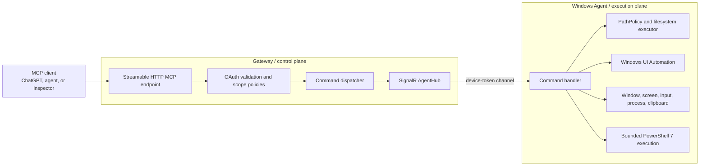

# AgentBridge

A Windows-first MCP bridge that lets AI agents inspect, control, and automate a real desktop through guarded filesystem, process, window, screen, UI Automation, clipboard, and PowerShell tools.

> **Status:** active development. Tool schemas and configuration may still change.
>
> The repository is named AgentBridge, while the current .NET projects and namespaces still use the internal `LocalMcp.*` name.

## Why AgentBridge exists

Browser automation is not enough when an agent must work with Notepad, terminals, media players, desktop IDEs, native dialogs, or applications that expose incomplete accessibility data.

AgentBridge provides a local execution layer between an MCP client and a Windows desktop. It prefers structured Windows UI Automation when possible, then falls back to guarded screenshots and coordinate input when an application does not expose a useful accessibility tree.

The bridge is designed around explicit boundaries:

- the MCP client talks only to the Gateway;
- the Gateway authenticates the client and applies scope policies;
- the Windows Agent performs local work through SignalR commands;
- filesystem access is restricted by configured roots;
- desktop input can be guarded by window handle, process ID, title, and foreground state;
- screenshots are returned as in-memory PNG data instead of temporary image files.

## Core capabilities

| Area | What AgentBridge can do | Representative tools |
|---|---|---|
| Desktop observation | List windows, capture the full virtual desktop, one monitor, a region, or one window, with bounds and DPI metadata | `window_list`, `screen_screenshot`, `window_screenshot` |
| Structured UI Automation | Inspect controls, find elements, read text and state, set values, click, select, toggle, scroll, focus, expand, and wait | `ui_tree`, `ui_find`, `ui_get_text`, `ui_click`, `ui_select`, `ui_toggle`, `ui_scroll`, `ui_wait` |
| Coordinate fallback | Click, double-click, right-click, drag, and scroll only while the expected window remains foreground | `screen_click`, `screen_double_click`, `screen_right_click`, `screen_drag`, `screen_scroll` |
| Window control | Focus, move, resize, drag, click, wait for, and close top-level windows | `window_focus`, `window_move`, `window_drag`, `window_click`, `window_wait`, `window_close` |
| Applications and processes | Resolve installed apps, launch or open them, wait for processes, list processes, and terminate an exact guarded PID | `app_resolve`, `app_launch`, `app_open`, `app_close`, `process_wait`, `process_list`, `process_kill` |
| Text and native dialogs | Read or replace clipboard text, send guarded key chords, type text, and set paths in Open or Save dialogs | `clipboard_get`, `clipboard_set`, `ui_hotkey`, `ui_type_text`, `file_dialog_set_path` |
| Files and Git | Read, search, patch, copy, move, delete, inspect Git state and history, and verify projects inside configured roots | `fs_read`, `fs_search_context`, `fs_batch_patch`, `git_status`, `git_diff`, `git_log`, `project_verify` |
| PowerShell | Run bounded PowerShell 7 commands, start observable sessions, poll status, and cancel process trees | `powershell_exec`, `powershell_start`, `powershell_status`, `powershell_cancel` |

The Gateway currently registers the complete tool surface from `src/LocalMcp.Gateway/Mcp/`. Aliases such as `ui_get_text` and `ui_hotkey` keep the public API readable while reusing the existing execution core.

## Requirements

- Windows with an interactive desktop session
- [.NET 8 SDK](https://dotnet.microsoft.com/download/dotnet/8.0)
- PowerShell 7 (`pwsh.exe`) for PowerShell tools
- An MCP client that supports Streamable HTTP
- An OAuth/OIDC provider when enabling desktop execution tools

The verified development path is Windows. A macOS or Linux desktop agent is not implemented. The Gateway is built with ASP.NET Core, but gateway-only cross-platform deployment is not currently documented or tested by CI.

## Quick Start

The shortest safe path is to build the solution, configure one dedicated directory, start the Gateway, then start the Windows Agent.

### 1. Clone and build

```powershell
git clone https://github.com/thanhdiner/Agent-Bridge.git
cd Agent-Bridge
dotnet restore .\LocalMcp.sln
dotnet build .\LocalMcp.sln -c Release --no-restore
```

### 2. Create a restricted working directory

```powershell
New-Item -ItemType Directory -Force C:\AgentBridgeWorkspace | Out-Null
```

Do not begin with an entire drive in `WritableRoots`. Start with one disposable workspace, test the policies, then expand deliberately.

### 3. Start the Gateway

Open terminal 1:

```powershell
$env:ASPNETCORE_ENVIRONMENT = "Development"
dotnet run --project .\src\LocalMcp.Gateway -c Release --no-build
```

The default development profile listens on `http://localhost:5227`.

### 4. Start the Windows Agent

Open terminal 2:

```powershell
$env:ASPNETCORE_ENVIRONMENT = "Development"
$env:Agent__DeviceId = "development-machine"
$env:Agent__GatewayUrl = "http://localhost:5227"
$env:FileAccess__AllowedRoots__0 = "C:\AgentBridgeWorkspace"
$env:FileAccess__WritableRoots__0 = "C:\AgentBridgeWorkspace"
$env:AppLaunch__AllowedExecutables__0 = "notepad.exe"

dotnet run --project .\src\LocalMcp.Agent.Windows -c Release --no-build
```

A successful first connection produces Agent and Gateway logs showing that the SignalR connection started and the device registered.

> **Important:** with client authentication disabled, filesystem read and write policies can run in local development, but `dev:execute` is intentionally denied. Desktop control, screenshots, process control, application control, and PowerShell tools require authenticated access with the `dev:execute` scope.

## Enable full desktop automation

Full desktop execution requires two separate authentication layers:

1. OAuth/OIDC protects MCP clients calling the Gateway.
2. A shared device token protects the Windows Agent connecting to the SignalR hub.

Use the same device token in the Gateway and Agent processes, but never commit it to JSON files.

### Gateway environment

```powershell
$env:ASPNETCORE_ENVIRONMENT = "Development"
$env:Security__AuthenticationEnabled = "true"
$env:Security__PublicExposure = "false"
$env:Security__PublicBaseUrl = "http://localhost:5227"
$env:Security__OAuth__Authority = "https://YOUR-TENANT.example.com/"
$env:Security__OAuth__Audience = "https://agentbridge.local"

$env:AgentSecurity__AuthenticationEnabled = "true"
$env:LOCALMCP_AGENT_TOKEN = "REPLACE_WITH_A_LONG_RANDOM_TOKEN"

dotnet run --project .\src\LocalMcp.Gateway -c Release
```

### Agent environment

```powershell
$env:ASPNETCORE_ENVIRONMENT = "Development"
$env:Agent__DeviceId = "development-machine"
$env:Agent__GatewayUrl = "http://localhost:5227"
$env:AgentSecurity__AuthenticationEnabled = "true"
$env:LOCALMCP_AGENT_TOKEN = "REPLACE_WITH_THE_SAME_TOKEN"

$env:FileAccess__AllowedRoots__0 = "C:\AgentBridgeWorkspace"
$env:FileAccess__WritableRoots__0 = "C:\AgentBridgeWorkspace"
$env:AppLaunch__AllowedExecutables__0 = "notepad.exe"

dotnet run --project .\src\LocalMcp.Agent.Windows -c Release
```

The OAuth access token used by the MCP client needs the appropriate scopes:

| Scope | Grants |
|---|---|
| `files:read` | Filesystem and Git inspection tools |
| `files:write` | File creation, patching, moving, copying, and deletion inside writable roots |
| `dev:execute` | Desktop, process, application, screenshot, PowerShell, and project verification tools |

For an internet-facing Gateway, use HTTPS, enable both authentication layers, and set `Security:PublicExposure=true`. Startup is rejected outside Development when public exposure is enabled without client authentication.

## Configuration reference

AgentBridge uses standard .NET configuration. Values can come from `appsettings.json`, ignored `appsettings.Development.json` files, command-line configuration, or environment variables using `__` as the section separator.

`appsettings.Local.json` is ignored by Git but is not loaded automatically by the current host setup. Use environment variables or `appsettings.Development.json` unless the application is changed to load an additional file.

| Setting or variable | Required | Default | Purpose |
|---|---:|---|---|
| `Agent__DeviceId` | Agent | none | Stable device identifier used by Gateway routing |
| `Agent__GatewayUrl` | Agent | none | Gateway base URL, normally `http://localhost:5227` in development |
| `FileAccess__AllowedRoots__0` | Agent | none | First filesystem root the Agent may inspect |
| `FileAccess__WritableRoots__0` | No | empty | First root that permits mutations; must be inside an allowed root |
| `AppLaunch__AllowedExecutables__0` | No | empty | First executable allowed for direct launch |
| `Security__AuthenticationEnabled` | No | `false` | Enables OAuth validation for MCP clients |
| `Security__PublicExposure` | No | `false` | Declares that the Gateway is reachable beyond the local machine |
| `Security__PublicBaseUrl` | With auth | empty | Public MCP resource URL used in OAuth metadata |
| `Security__OAuth__Authority` | With auth | empty | OIDC authority URL |
| `Security__OAuth__Audience` | With auth | empty | Expected access-token audience |
| `AgentSecurity__AuthenticationEnabled` | No | `false` | Requires a device bearer token on the SignalR hub |
| `AgentSecurity__TokenEnvironmentVariable` | No | `LOCALMCP_AGENT_TOKEN` | Name of the environment variable containing the device token |
| `LOCALMCP_AGENT_TOKEN` | With agent auth | none | Shared Agent-to-Gateway token |

The tracked Agent configuration also defines denied path segments, denied credential filenames, blocked key and certificate extensions, and size limits. Review those rules before widening access.

## Architecture



The Gateway does not directly touch the desktop. It validates and routes commands. The Agent is the only component that accesses the local filesystem, Windows APIs, UI Automation, processes, clipboard, and interactive desktop.

## Typical agent workflow

A reliable desktop workflow usually follows this order:

1. Call `device_list` or `device_status` to confirm the Agent is online.
2. Call `window_list` to locate the target window and capture its handle and PID.
3. Prefer `ui_find`, `ui_tree`, or `ui_get_text` to work through accessibility metadata.
4. Use `window_screenshot` or `screen_screenshot` when the app exposes incomplete UI Automation data.
5. Use coordinate input only with the expected foreground window, PID, and title guards.
6. Verify the result through UI state, text, a screenshot, or process/window status.

For long text entry, the practical path is often `clipboard_set` followed by a guarded `ui_hotkey` using `CTRL+V`.

## Security model

AgentBridge exposes powerful local capabilities. Treat it as privileged automation infrastructure, not a harmless chat plugin.

- **Execution is not anonymously available.** `dev:execute` fails when client authentication is disabled.
- **Read and write are separate.** A client with `files:read` does not automatically receive mutation access.
- **Writes are root-scoped.** `WritableRoots` must sit inside `AllowedRoots`.
- **Sensitive paths are blocked.** The policy rejects configured segments, credential filenames, and key or certificate extensions.
- **PowerShell is bounded.** Scripts, output, and runtime have hard limits; process trees are terminated on timeout or cancellation.
- **PowerShell secrets are stripped.** Child processes remove environment variables whose names resemble tokens, passwords, API keys, credentials, cookies, or bearer secrets.
- **Coordinate input is guarded.** Screen actions verify the expected foreground window and can additionally check PID, title, and monitor.
- **Process termination is PID-first.** `process_kill` supports an expected-name guard against PID reuse and refuses protected Windows processes and the Agent itself.
- **Screenshots stay in memory.** Screenshot tools return PNG payloads with integrity metadata and do not create image files.

Do not run the Agent as administrator for normal use. PowerShell execution is deliberately disabled when the Agent process is elevated.

## Testing

Run the complete solution test suite:

```powershell
dotnet test .\LocalMcp.sln -c Release
```

The repository includes:

- unit tests for policies, tools, command validation, UI Automation, screenshots, input, process control, clipboard, and PowerShell;
- integration tests for Gateway authentication and the SignalR command path;
- architecture tests for project dependency boundaries.

Some tests interact with Windows APIs and therefore require Windows. A small number of explicitly gated tests open real interactive dialogs only when their environment flag is enabled.

## Troubleshooting

### Agent startup fails with `FileAccess:AllowedRoots must contain at least one valid root directory`

The Agent refuses to start without an allowed filesystem root. Set at least `FileAccess__AllowedRoots__0` to a real directory.

### Desktop tools return `FORBIDDEN`

This is expected when `Security:AuthenticationEnabled=false`. Configure OAuth/OIDC and request the `dev:execute` scope. There is no anonymous execution bypass.

### Gateway or Agent reports a missing Agent token

`AgentSecurity:AuthenticationEnabled` is true, but the configured token environment variable is empty. Set `LOCALMCP_AGENT_TOKEN` to the same value in both process environments.

### PowerShell tools report that `pwsh.exe` is unavailable

Install PowerShell 7 and confirm this works in the Agent terminal:

```powershell
pwsh --version
```

Also confirm the Agent is not running elevated.

### A UI control cannot be found

Inspect the target with `ui_tree` or `ui_find`. Some Electron, Chromium, game, media, and custom-rendered interfaces expose little or no useful accessibility data. Use a screenshot and guarded coordinate input as the fallback.

### Build output is locked

Stop running Gateway and Agent processes before rebuilding their default output directories. A running .NET process can hold the generated DLLs open on Windows.

## Project layout

```text
src/
  LocalMcp.Gateway/         MCP HTTP server, authentication, policies, SignalR hub, tool schemas
  LocalMcp.Agent.Windows/   Windows execution engine, UI Automation, Win32, filesystem, PowerShell
  LocalMcp.Contracts/       Commands and result contracts shared across the SignalR boundary
  LocalMcp.BuildingBlocks/  Shared errors and serialization

tests/
  LocalMcp.UnitTests/
  LocalMcp.IntegrationTests/
  LocalMcp.ArchitectureTests/
```

## Model, data, and cost behavior

AgentBridge does not embed or call an AI model. Model selection, conversation retention, provider billing, and prompt handling belong to the MCP client and its provider.

The bridge receives only the tool calls sent by that client. Local data returned by a tool, including screenshots, file contents, window metadata, and clipboard text, is sent back through the configured Gateway connection. Configure roots and permissions with the assumption that returned data may enter the client conversation.

## Contributing

Before opening a change:

```powershell
dotnet build .\LocalMcp.sln -c Release
dotnet test .\LocalMcp.sln -c Release
```

Keep tool inputs bounded, preserve structured error codes, add metadata and schema tests for public MCP changes, and avoid widening filesystem or desktop permissions silently.

## License

No license file is currently included in this repository. Until a license is added, the code is not automatically granted an open-source usage license.
